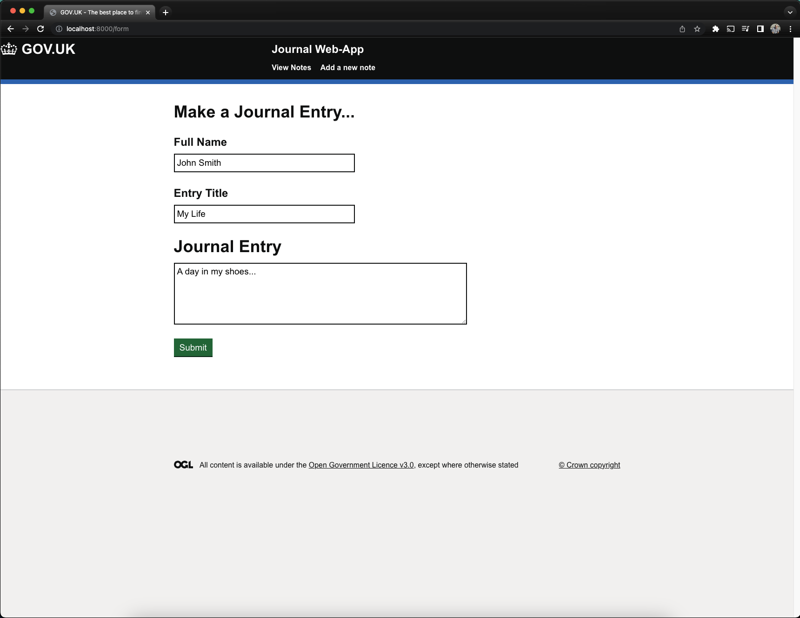
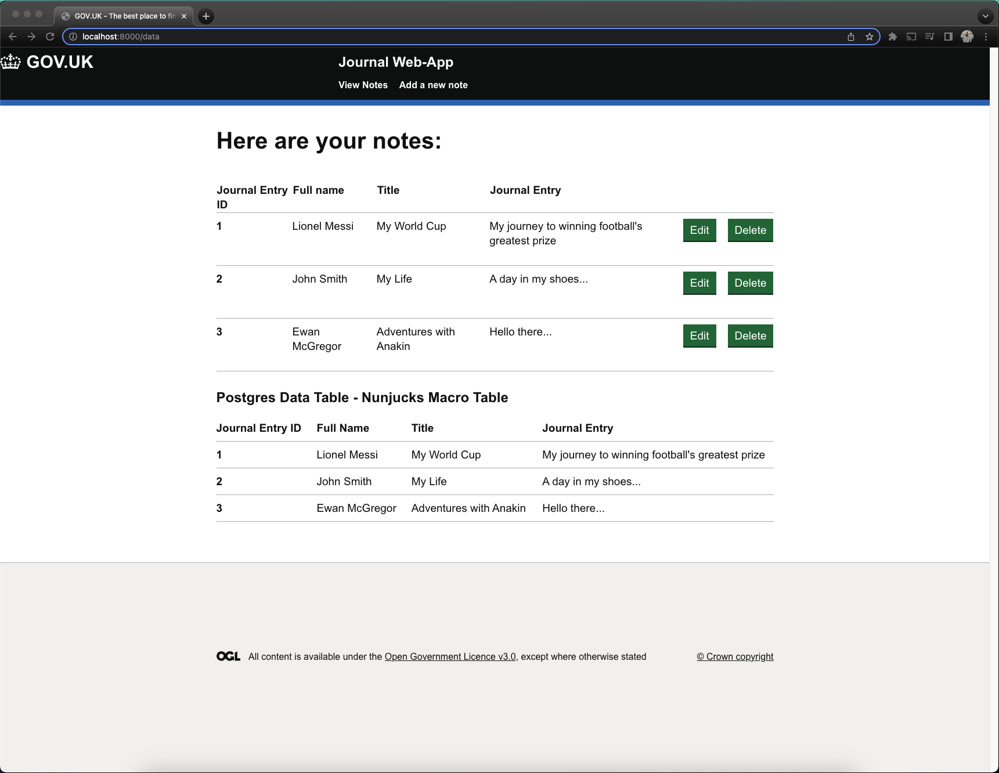

# Full-Stack-GOV.UK-Web-App

## Overview

A full stack, MVC web application with CRUD capability built using:

- TypeScript/Node --> backend/server
- Nunjucks --> views/templating engine
- PostgreSQL --> database
- [GOV.UK Frontend Design System](https://frontend.design-system.service.gov.uk/use-nunjucks/) --> CSS Framework/Nunjucks Macros
- Docker --> containerisation

## Pre-requisites to run Web-App

- Docker

## Configuration

After cloning the repository, create a .env file and add the following environment variables to it:

```
PORT=8000
POSTGRES_USER=postgres
POSTGRES_HOST=db
POSTGRES_DB=journal
POSTGRES_PASSWORD=password
POSTGRES_PORT=5432
```

## Running production build

Run ```docker-compose up``` to create a production build of the web app.
This will create two Docker containers which contain a PostgreSQL database and a Node server. Open http://localhost:8000/ to access the webpage. To populate the database, navigate to the form tab and submit some information. Then navigate to the data tab to view the submitted data in tables.

To stop the containers, run ```docker-compose down```. This will delete any data that had been stored in the PostgreSQL container.

To persist data after containers have been stopped, uncomment line 14 in the docker-compose.yml file before running ```docker-compose up```

## Running development build

Run ```make run``` to create a development build of the web app.
This will create one Docker container which contains a PostgreSQL database, and will locally run a Node server. Open http://localhost:8000/ to access the webpage.

Run ```make stop``` to stop the PostgreSQL container and kill the Node server.

## Web App example

### Form page:

<p align="center">
  
</p>

### Data page:

<p align="center">
  
</p>


